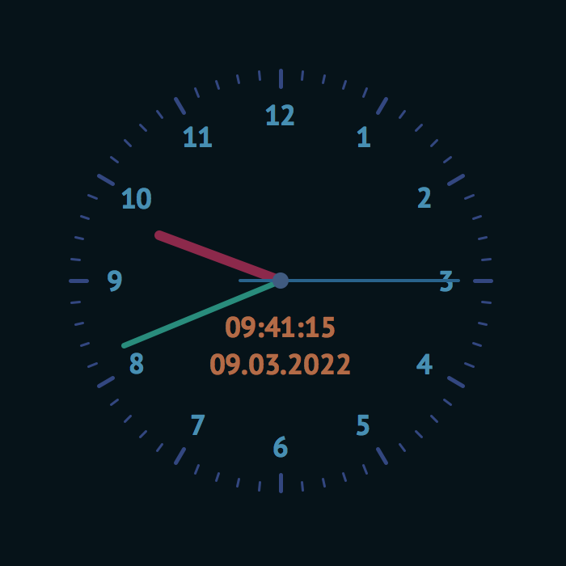

# Analog clock



A simple analog clock app written in [Python](https://www.python.org) using the built-in [`tkinter`](https://docs.python.org/3/library/tkinter.html) library.

## Requirements

- [Python 3](https://www.python.org) with [`tkinter`](https://docs.python.org/3/library/tkinter.html)
- _(Optional)_ [PT Sans](https://fonts.google.com/specimen/PT+Sans) font

## Launching

To start the app, download or clone this repository, and in the folder you downloaded or cloned, run:

```
$ python analog_clock.py
```
